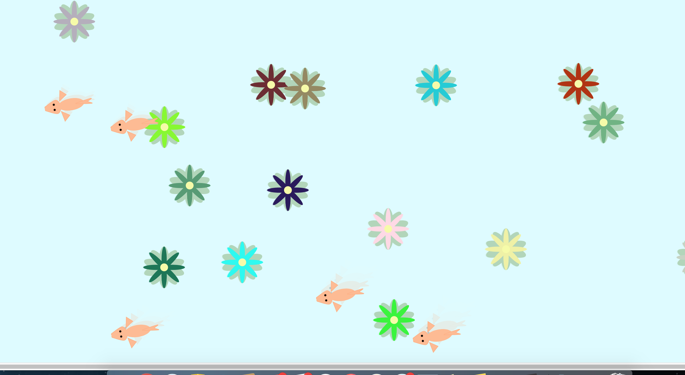

## Zen-Yatta

### A Place to Feel at Peace

Need a break from a stressful day?

Come to Zen-Yatta Koi Pond

### How it works

Zen-Yatta Koi Pond will help you de-stress yourself after a long day.
Listen to the waves as the fish swims around.

You can add or delete flowers by clicking!
(Each flower is a different color!)

\*\* if the display is too small! you can left-click on the top left corner to maximize your screen!

\*\* if you want to exit our your maxed screen, left-click on the top left corner.

### Next Batch!

* User will be able to feed the koi fish.
* User will be able to play with the koi fish, by following the cursor.
* Different music will be played.
* Different variety of flowers.

### Languages/Libraries used:

* p5.js
